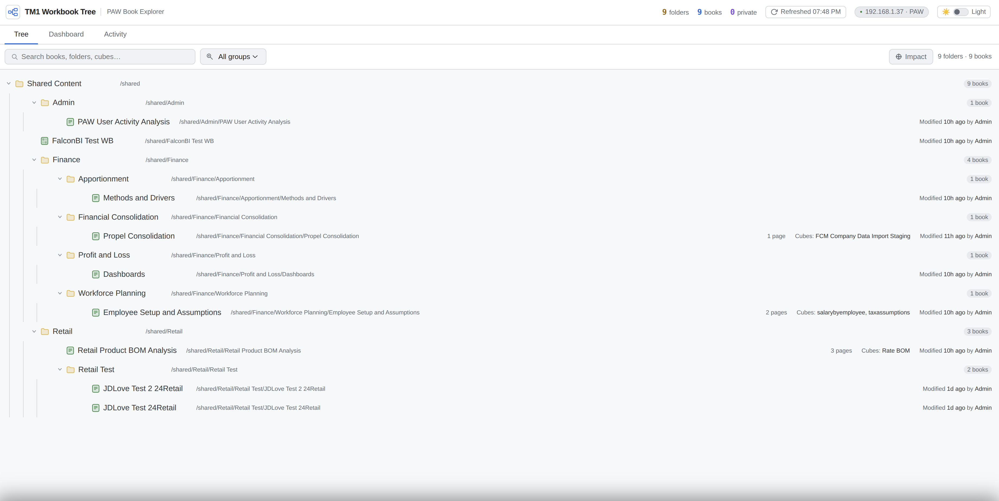
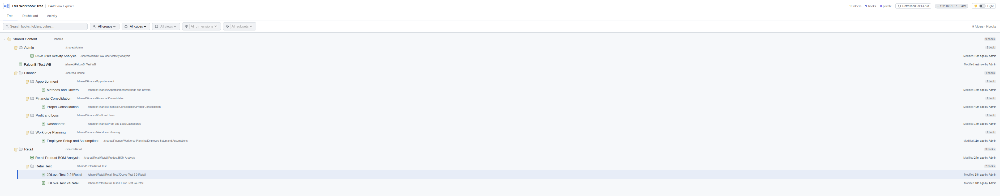
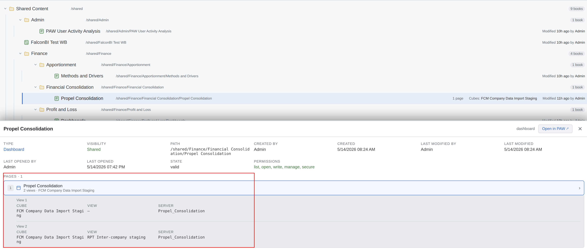
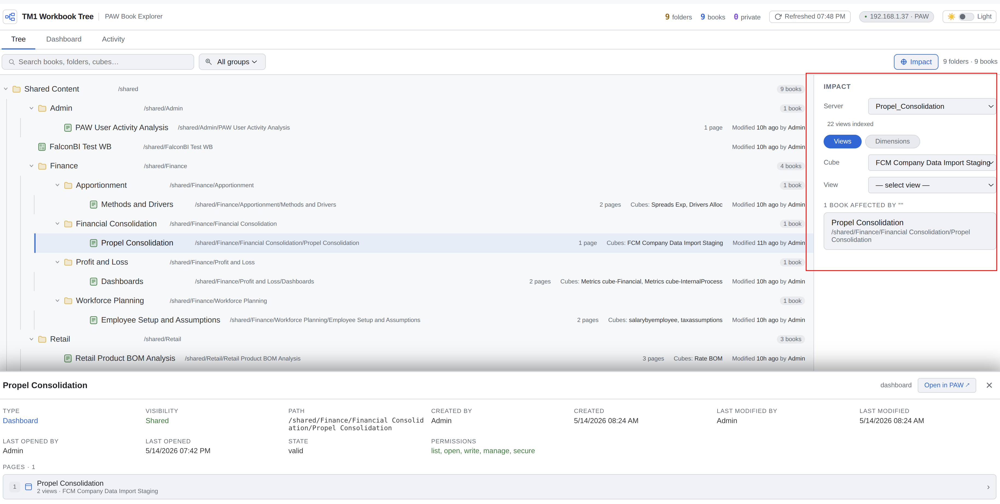
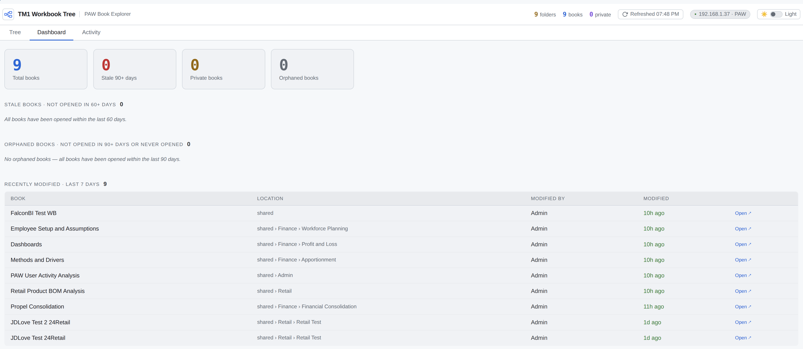
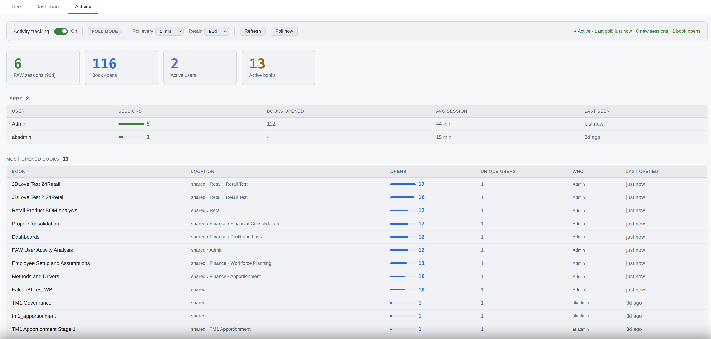

# TM1 PAW Tree — User Guide

## Overview

PAW Tree is a governance tool for IBM Planning Analytics Workspace V11. It gives administrators visibility into all PAW books — their structure, TM1 connections, usage history, and ownership — in a single interface.



---

## Interface Layout

```text
┌─────────────────────────────────────────────────────────┐
│  Logo  TM1 Workbook Tree   [stats]  [Refresh]  [🌙]    │  ← Topbar
├─────────────────────────────────────────────────────────┤
│  Tree │ Dashboard │ Activity                            │  ← Tab strip
├─────────────────────────────────────────────────────────┤
│  [Search…]  [Group filter]              [Impact]        │  ← Toolbar
├────────────────────────────┬──────────────────┬─────────┤
│                            │                  │         │
│   Folder/Book Tree         │  Impact Panel    │ Detail  │
│                            │  (when open)     │ Drawer  │
│                            │                  │         │
└────────────────────────────┴──────────────────┴─────────┘
```

---

## Tree Tab



### Navigating the Tree

- Click a **folder** to expand/collapse it.
- Click a **book** to open its detail drawer on the right.
- Books show a **page count** and the **cubes** referenced once tabs are loaded.
- A **lock icon** with an owner name indicates a private book.

### Book Icons

| Icon         | Type       | Description                         |
|--------------|------------|-------------------------------------|
| Lined document | Dashboard | Classic PAW tabbed book            |
| Grid/tile    | Workbench  | New PAW Workbench experience        |

### Search

Type in the search box to filter by book name, folder name, or cube name. Results show matching books across all folders with their folder path.

### Group Filter

Select a group from the dropdown to overlay that group's folder permissions on the tree. Books in folders where the group has no access are visually de-emphasised.

### Refresh Button

Click **Refresh** in the topbar to re-fetch the full tree from PAW. The button spins while loading and shows the last refresh time on completion.

---

## Book Detail Drawer



Click any book to open its detail panel on the right.

### Metadata Section

Shows book type, visibility (shared/private), owner, path, created/modified dates, last opened date, state, and permissions.

### Pages Section

Lists all tabs (pages) in the book. Each page card shows:

- Page name and number
- Number of TM1 views on the page
- Cube and view name(s) — expand a card to see full detail

Pages are loaded on demand when you first open a drawer. Subsequent opens use the cached data.

---

## Impact Panel



Click the **Impact** button in the top-right of the toolbar to open the Impact panel alongside the tree.

The Impact panel answers the question: *"If I change this TM1 object, which PAW books will be affected?"*

### Views Track

1. **Select a server** — immediately shows all PAW books that reference any view on that server
2. **Select a cube** — narrows to books referencing any view in that cube
3. **Select a view** — narrows to books referencing that specific view

### Dimensions Track

Switch to the **Dimensions** subtab to filter by dimension or subset instead.

1. **Select a dimension** — shows books referencing any view that uses that dimension
2. **Select a subset** — narrows to views that specifically use that subset

### Navigating to a Book

Click any result card to expand its folder in the tree, scroll to it, and open its detail drawer. The Impact panel stays open alongside the tree.

### Index Status

The impact index is built automatically on first use by scanning cached PAW book content. The status line shows how many view references were indexed. Click **Rebuild index** if books have been added or changed since last build.

---

## Dashboard Tab



Provides a statistical overview of all PAW content:

- **Total books, folders, private books**
- **Orphaned books** — books with no recorded opens in the last 90 days, or never opened. These are candidates for archiving or deletion.
- **Private book inventory** — all private books by user, with creation and last-opened dates.

---

## Activity Tab



Tracks real PAW book usage over time using background polling.

### How It Works

Every N minutes (configurable), the server calls the PAW API and checks each book's `used_date`. When a book's date changes, it records a **hit** under a **session** for that user. Opens within 2 hours are grouped into the same session.

> Activity only reflects opens detectable via the PAW API's `used_date` field. User attribution depends on PAW's own `used_by` metadata.

### Controls

| Control       | Description                                         |
|---------------|-----------------------------------------------------|
| On/Off toggle | Enable or disable background polling                |
| Poll every    | Set the polling interval (5 / 15 / 30 / 60 min)    |
| Retain        | How many days of history to keep (30–365 days)      |
| Refresh       | Reload the stats display from the database          |
| Poll now      | Trigger an immediate poll of PAW                    |

### Stats Displayed

- **Sessions** — distinct usage sessions detected (grouped by 2-hour window)
- **Book opens** — total individual book open events recorded
- **Top books** — most-opened books with unique user counts
- **User activity** — sessions and book opens per user
- **Daily activity** — sessions per day over the last 30 days
- **Recent sessions** — last 20 sessions with books opened

---

## Administration

### Startup

```bash
cd ~/apps/tm1_paw_tree
source venv/bin/activate
python3 app.py
```

Server runs on port **8082** by default.

### Production (Gunicorn)

```bash
bash
gunicorn -w 4 -b 0.0.0.0:8082 app:app
```

### Activity Database

The SQLite activity database is stored at `activity/activity.db`. It is excluded from version control. To reset activity history, stop the server and delete the file — it will be recreated on next startup.

---

## Troubleshooting

| Symptom | Likely cause | Fix |
| ------- | ------------ | --- |
| Tree shows "Failed to load" | PAW unreachable or wrong credentials | Check .env and network access to PAW |
| Book drawer shows no pages | Book has no TM1 widgets | Expected for text-only books |
| Impact panel shows 0 books | Index not built or book cache empty | Wait for tree to load, then click Rebuild index |
| Cube dropdown empty in Impact | TM1 server offline or wrong protocol | Check servers.json — set ssl: true for HTTPS databases |
| Changes in PAW not showing | PAW server-side cache | Click Refresh — app sends Cache-Control: no-cache |
